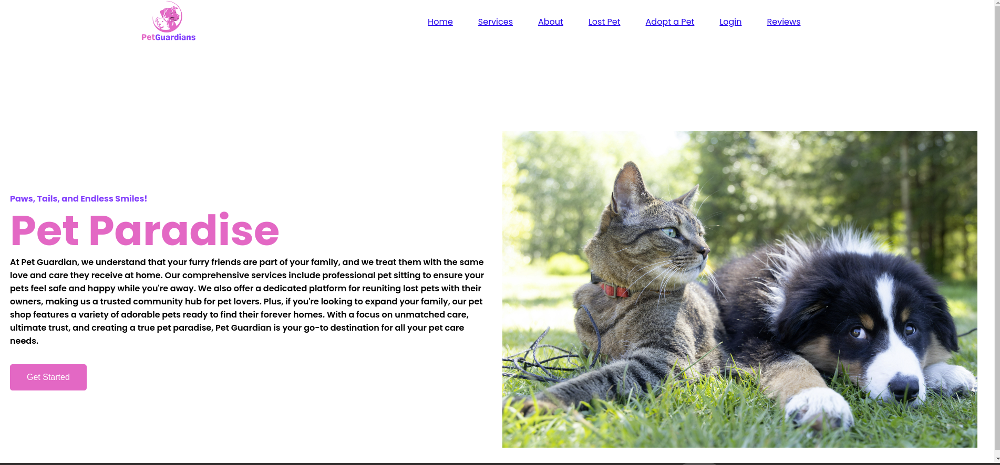

# PetGuardians
PetGuardians is a website designed to help people find lost pets and give others the opportunity to adopt them if the original owners are not found. The website allows pet owners to post information about their lost pets, including details like the pet's description, location, and image. Other users can view these posts and offer to adopt the pet if the owner is untraceable.

## Features
Post Lost Pets: Users can post lost pet information, including the pet's name, breed, description, location, and an image.
Adopt Lost Pets: If the original owner is not found, users can adopt the pet by contacting the person who posted the listing.
Simple Interface: The website has a user-friendly interface designed using HTML and CSS for easy navigation.
## Technologies Used
HTML: For structuring the content of the website.
CSS: For styling the website and ensuring a responsive, user-friendly design.

  

